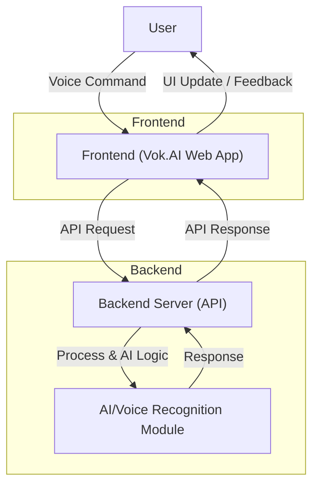

<!-- Vok.AI Logo -->

  

# Vok.AI

**Voice-powered communication & productivity platform**

---

## How Vok.AI Works

- **User**: Interacts with the app using voice commands.
- **Frontend**: Captures voice, sends requests, and updates the UI.
- **Backend**: Handles API requests, processes data, and manages AI logic.
- **AI/Voice Module**: Performs voice recognition and intelligent automation.

---

  <b>Simple. Fast. Voice-first.</b>

 